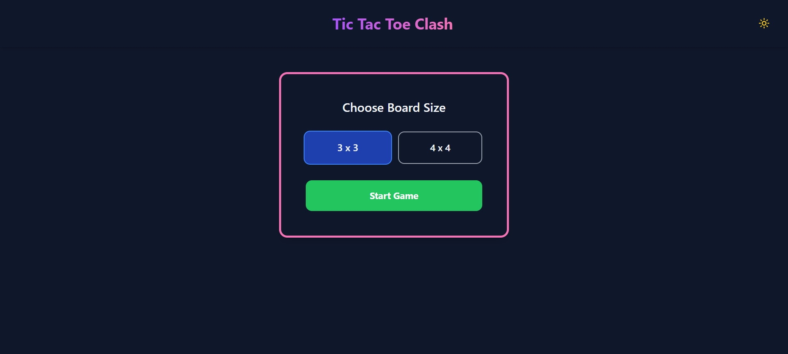
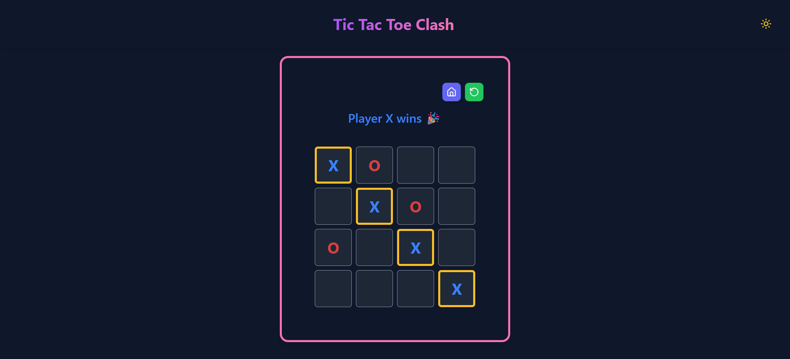

# 🕹️ Tic Tac Toe Clash - React + TypeScript

A fully responsive, accessible Tic Tac Toe game built with React, TypeScript, and Tailwind CSS — supports both **3x3 and 4x4** grid sizes, tracks players, and celebrates wins with confetti 🎉.

## ✨ Features

- ✅ Play against another player locally (X vs O)
- 🎛️ Switch between 3x3 or 4x4 board sizes
- 🧠 Smart game state management using `useReducer`
- 🪄 Win detection + draw detection
- 💎 Highlights Winning combination
- 🎉 Confetti celebration on win (`canvas-confetti`)
- 🌗 Light/dark mode friendly
- ♿ Fully accessible: keyboard + screen reader support
- 🎨 Clean UI with Tailwind + Lucide icons

---

## 🚀 Getting Started

### 1. Clone the repo

```bash
git clone https://github.com/Pushparaj96/tic-tac-toe.git
cd tic-tac-toe

2. Install dependencies
npm install

3. Start the dev server
npm run dev

```

### 🛠️ Tech Stack

React (with Hooks)

TypeScript

Tailwind CSS

canvas-confetti

Lucide React (icons)

## 📸 Screenshots

### Home



### 🟦 3x3 Board


### 🟪 4x4 Board



## 🔗 Live Demo

👉 [Play it here]()
